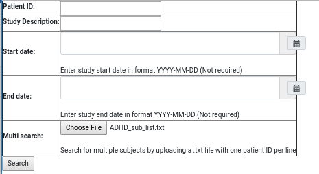
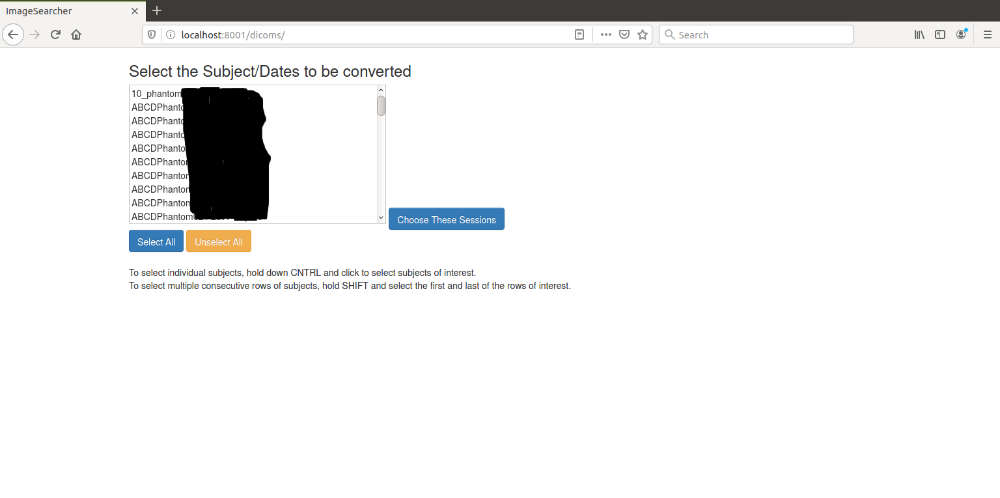
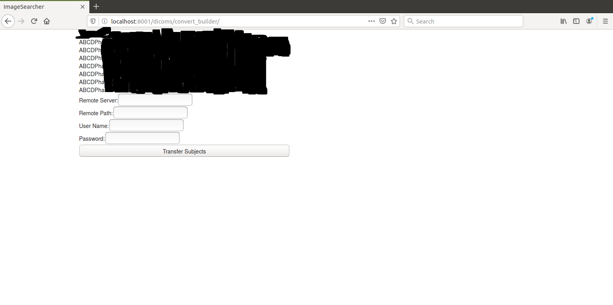
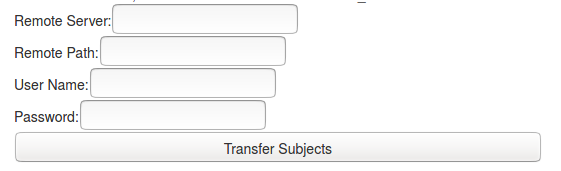
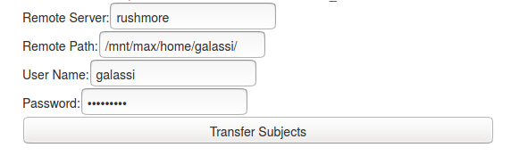

# ImageSearcher: Better, Faster, Stronger
## Description:
ImageSearcher is a gui resource designed to allow a user to search for a session(s) and to transfer those images across to another server. Images are extracted from the AIRC's session subfolder structure into a single folder per session labeled <subject>_<sessiondate>.

## Installation
- `git clone https://gitlab.com/Fair_lab/ImageSearcher.git`
- `set up a python 3 virtual environment`
- `venv --python=<your python 3 path>`
- `source venv/bin/activate`
- `pip install -r requirements.txt`
- `python manage.py makemigrations`
- `python manage.py migrate`
- change path in dicoms/indexer.py under `__main__` to your local dicom path.
- index path using `python manage.py index`

## Use
### Starting the App
- to start the application `python manage.py runserver <Your preferred port: eg 8888>`
- Open a webrowser and navigate to localhost:<Your preferred port>/dicoms/search
### Locating Subjects/Sessions (Search Page)

- Then type in your sub-ID, and any other project information to help find your subjects
- If you wish to search for the same list of subjects simply upload a text file with one subject per line using the `Choose File` button in the `Multi Search` row of the search table. Subject lists should have [this](images/subject_list.png) formatting.

Next the user need only select the desired subjects/session:

And click the choose these sessions button.

### Subject/Session Selection
After executing a search you will be directed to the search results page here:

Next fill in the fields below:

They should look like this when you're done:

To transfer the sessions just click the Transfer Subjects button.